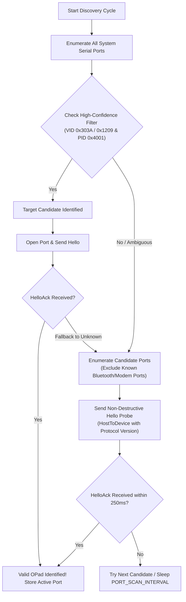

# OPad Software Architecture Breakthrough & Production Readiness Audit

**Author:** Antigravity (Google DeepMind)  
**Date:** 2026-09-22  
**Scope:** Desktop Workspace (`daemon`, `gui`, `cli`, crates), Firmware Host Interface, Packaging & Cross-Platform Reliability (Linux / Windows)

---

## 1. Executive Summary & System Breakthrough

The OPad project is an ultra-low-latency rhythm gaming keypad and telemetry companion suite for *osu!*. The system consists of:
1. **Firmware (ESP32-S3):** Composite USB device implementing dual HID keyboard (1000 Hz polling) and CDC-ACM serial telemetry over USB-OTG.
2. **Desktop Daemon (`opad-daemon`):** Background service maintaining exclusive serial communication with the pad, running SQLite storage, managing counter synchronization, supervising `tosu` (osu! memory reader), and serving IPC requests.
3. **Desktop GUI (`opad-gui`):** Iced-based UI application functioning as a configuration dashboard, layout designer, telemetry monitor, real-time switch chatter tester, and system tray applet.
4. **Desktop CLI (`opadctl`):** Command-line utility for manual flashing, device diagnostics, setup, and backup management.
5. **Shared Crates:** `opad-device` (serial transport & flash bootloader client), `opad-ipc` (Unix socket / Windows named pipe transport), `opad-model` (domain data & filesystem path resolution), `opad-protocol` (Protobuf serialization), `opad-storage` (SQLite database with WAL), `opad-tosu` (WebSocket client & supervisor), and `opad-update` (atomic update engine).

### Root Causes of Cross-Platform Failures & Fresh-Machine Breakages

When installing OPad on clean machines or testing across different platforms (Linux vs. Windows), multiple systemic friction points appear:
1. **Serial Port Pinning & Rigid Filtering:** The desktop suite relies on exact USB Vendor and Product IDs (`0x303A:0x4001`) enumerated via `serialport::available_ports()`. On many Linux environments (virtual machines, containers, certain USB hubs, or USB-UART bridges like CH340/CP2102), sysfs returns `SerialPortType::Unknown`, causing the discovery routine to fail even though `/dev/ttyACM0` or `/dev/ttyUSB0` is fully available and readable. Furthermore, ancillary scripts still pin specific port names (`COM3` or `/dev/ttyACM0`).
2. **Linux vs. Windows Diagnostic Blindness:** The in-game switch chatter and latency diagnostic suite relies on Windows-specific Win32 APIs (`GetAsyncKeyState` and `kernel32::Beep`). On Linux, key state polling returns `false` unconditionally, meaning global background input monitoring and audio alerts do not work at all during gameplay.
3. **Linux `tosu` Memory Reading Blocks (Yama Ptrace):** `tosu` relies on inspecting the memory of `osu!.exe` (running under Wine/Proton on Linux). Modern Linux distributions enforce `kernel.yama.ptrace_scope = 1`, which prohibits non-child processes from invoking `process_vm_readv` without `cap_sys_ptrace`. Consequently, `tosu` launches and maintains WebSocket connectivity, but never extracts gameplay telemetry on Linux.
4. **Desktop Environment & Tray Fragility:** The Linux GUI depends on `ksni` (D-Bus StatusNotifierItem). On default GNOME desktop environments (Ubuntu, Fedora) without third-party appindicator extensions, tray initialization fails (`TrayEvent::Unavailable`). When the user closes the window, the GUI process terminates, breaking background synchronization if the daemon is not running independently as a systemd user service.
5. **Systemd User Unit Target Mismatch:** The Linux systemd user service specifies `WantedBy=graphical-session.target`. Many desktop environments (e.g., standalone window managers, Wayland compositors like Sway/Hyprland, or custom sessions) do not activate `graphical-session.target`, resulting in the daemon failing to start on login.
6. **Framing Resynchronization Vulnerability:** Both firmware (`frame_parser.c`) and host (`decode_device_message`) use length-prefix framing without a magic preamble or byte-stuffing. If a single byte of noise occurs during USB enumeration or boot, framing alignment can be permanently lost until the buffer is manually cleared.

---

## 2. Serial Port Auto-Detection: Eliminating Port Pinning

### 2.1 The Current Detection Bottleneck

In `desktop/crates/opad-device/src/lib.rs:721-727`:
```rust
fn find_usb_port(vid: u16, pid: u16) -> Option<String> {
    serialport::available_ports()
        .ok()?
        .into_iter()
        .find(|p| matches!(&p.port_type, SerialPortType::UsbPort(info) if info.vid == vid && info.pid == pid))
        .map(|p| p.port_name)
}
```
This implementation has four major failure modes:
1. **Sysfs Permission & Driver Truncation on Linux:** `serialport-rs` discovers USB properties by parsing `/sys/class/tty/<dev>/device/../idVendor`. In containerized environments, sandboxes, VMs with pass-through, or non-standard kernel driver topologies, these sysfs nodes may be unreadable or return `SerialPortType::Unknown`. The filter rejects them silently.
2. **PID Changes & Open Source USB IDs:** The project has planned transitioning from Espressif's experimental PID (`0x303A:0x4001`) to pid.codes (`0x1209:<allocated_pid>`). Any hardware running a different PID, custom bootloader, or developer board with standard CDC (`0x303A:0x1001` or `0x303A:0x0002`) is ignored.
3. **USB-UART Adapters:** Hardware prototypes or modular keypads utilizing external USB-to-UART bridges (FTDI, CP2102, CH340) carry different VIDs/PIDs entirely (`0x10C4`, `0x1A86`, `0x0403`).
4. **Remaining Hardcoded Artifacts:** 
   * `scripts/trigger_easter_egg.py:139-145` defaults to `COM3` on Windows and iterates over a hardcoded slice `["/dev/ttyACM0", "/dev/ttyACM1", "/dev/ttyUSB0"]`.
   * `scripts/bench_latency.py:15-32` is Linux-only, searching for `/dev/input/by-id/*OPad*` and parsing raw Linux `input_event` structs.

### 2.2 Proposed Zero-Pinning Architecture: Heuristic Probe + Handshake Discovery

Instead of requiring the user to specify a port (`--port`) or relying exclusively on rigid USB metadata, the system should implement a **two-tier automatic discovery engine**:



#### Specification of the Robust Discovery Protocol:
1. **Tier 1 (Fast Path):** Query `serialport::available_ports()`. If a device matches known VIDs (`0x303A`, `0x1209`) and PIDs (`0x4001`, `0x1001`), immediately select it as the primary candidate.
2. **Tier 2 (Probing Path):** If no device matches Tier 1, take all available serial ports (ignoring standard system serial ports like `COM1`/`COM2` or `/dev/ttyS*`), open each candidate with a 150 ms timeout, and transmit a framed `Hello` message.
3. **Handshake Verification:** Only promote a port to "Connected" when a valid `HelloAck` protobuf envelope is received containing `device_id` starting with `"OSUPAD-"`.
4. **Dynamic Reconnection:** If the active port drops (unplugged or rebooted into bootloader), return to continuous Tier 1 & Tier 2 scanning without requiring daemon restart or configuration changes.

---

## 3. Windows vs. Linux Discrepancies & Platform Bugs

### 3.1 Global Switch Chatter & In-Game Latency Diagnostics
* **Problem:** In [`desktop/gui/src/diagnostics.rs:16-47`](file:///home/paella/Documents/projects/esp32/osu-pad-esp32/desktop/gui/src/diagnostics.rs#L16-L47) and [`test_hw_input.rs:4-49`](file:///home/paella/Documents/projects/esp32/osu-pad-esp32/desktop/crates/opad-device/examples/test_hw_input.rs#L4-L49), global key tracking uses Win32 `GetAsyncKeyState` and audio alert uses `kernel32::Beep`. On Linux:
  * `is_key_down` is hardcoded to return `false`.
  * `play_chatter_beep` is a no-op.
  * In [`desktop/gui/src/main.rs:1514`](file:///home/paella/Documents/projects/esp32/osu-pad-esp32/desktop/gui/src/main.rs#L1514), the 250 Hz `DiagnosticsPoll` timer is gated with `#[cfg(windows)]`.
* **Impact:** Linux users can only test keys by clicking into the OPad window and typing directly into Iced text inputs. They cannot verify contact bounce while playing *osu!* in-game.
* **Solution for Linux:**
  * Use Linux `evdev` to read from the keyboard device node (`/dev/input/by-id/*OPad*` or matching VID/PID). Because `70-opad.rules` applies `TAG+="uaccess"`, the logged-in user has permission to read the event node directly.
  * Use ALSA or standard desktop beep (e.g., generating a simple PCM sine wave via `rodio` or writing `\x07` / PulseAudio/PipeWire bell) for cross-platform audio alerts.

### 3.2 `tosu` Memory Reader: Yama Ptrace Scope on Linux
* **Problem:** `tosu` is a Node.js-based memory scraper that inspects *osu!* process memory. On Windows, it calls `OpenProcess` and `ReadProcessMemory`. On Linux, Wine runs `osu!.exe` as an x86/x64 Linux process. To read its memory, `tosu` calls `process_vm_readv` or accesses `/proc/<pid>/mem`.
* **Impact:** Modern Linux kernels (Ubuntu $\ge$ 20.04, Debian $\ge$ 11, Fedora, Arch) default to `kernel.yama.ptrace_scope = 1`. This restricts process inspection strictly to direct parent-child hierarchies. As a result:
  * `tosu` starts successfully and reports WebSocket connected (`DEFAULT_TOSU_ENDPOINT`), but logs `EPERM` / `Operation not permitted` when attempting to attach to the game process.
  * No gameplay telemetry, song metadata, combo, accuracy, or hit errors are ever broadcast to the daemon or the pad's LCD display.
* **Solution:**
  1. The Linux packaging scripts (`postinst`, `build_appimage.sh`, and `PKGBUILD`) should assign file capabilities to the bundled `tosu` binary:
     ```bash
     sudo setcap cap_sys_ptrace=eip /usr/lib/opad/tosu/tosu
     ```
  2. The GUI/CLI setup checks should detect `kernel.yama.ptrace_scope > 0` and display an informative guide if `tosu` is failing to attach.

### 3.3 System Tray & Window Lifecycle
* **Problem:** In [`desktop/gui/src/tray.rs:294-321`](file:///home/paella/Documents/projects/esp32/osu-pad-esp32/desktop/gui/src/tray.rs#L294-L321), Linux system tray uses `ksni` (StatusNotifierItem over D-Bus). Default GNOME Shell does not support StatusNotifierItem without `gnome-shell-extension-appindicator`.
* **Impact:**
  * When missing, `tray::stream()` emits `TrayEvent::Unavailable`.
  * In [`desktop/gui/src/main.rs:1403-1410`](file:///home/paella/Documents/projects/esp32/osu-pad-esp32/desktop/gui/src/main.rs#L1403-L1410):
    ```rust
    Message::CloseRequested(id) => {
        if self.tray_available == Some(false) {
            return iced::exit();
        }
        self.window = None;
        return window::close(id);
    }
    ```
    If `self.tray_available` has not resolved yet (`None`), closing the window hides the window (`self.window = None`) but does not exit the app, creating an unreachable background zombie process.
  * When autostarted with `--tray` on a desktop without tray support, it unexpectedly pops open the full UI window.
* **Solution:**
  * Initialize `tray_available` with a deterministic timeout.
  * If tray support is absent on Linux, allow a configuration toggle for "Minimize to taskbar instead of exit" or cleanly terminate with an explicit warning banner.

### 3.4 Systemd User Service vs. Non-GNOME Desktop Sessions
* **Problem:** In [`packaging/linux/systemd-user/opad-daemon.service.in:3-4`](file:///home/paella/Documents/projects/esp32/osu-pad-esp32/packaging/linux/systemd-user/opad-daemon.service.in#L3-L4):
  ```ini
  After=graphical-session.target
  PartOf=graphical-session.target
  ...
  WantedBy=graphical-session.target
  ```
* **Impact:** Standalone window managers (i3, bspwm, dwm, awesome), Wayland compositors (Hyprland, Sway), and some XFCE/LXQt distributions do not populate `graphical-session.target`. Enabling the unit via `systemctl --user enable opad-daemon.service` succeeds, but the service is never triggered upon login.
* **Solution:** Use `WantedBy=default.target` with `After=default.target` or standard XDG autostart for the user daemon.

### 3.5 Legacy Path Inconsistencies on Linux
* **Problem:** In [`desktop/gui/src/platform_linux.rs:103`](file:///home/paella/Documents/projects/esp32/osu-pad-esp32/desktop/gui/src/platform_linux.rs#L103):
  ```rust
  let log_dir = ... .join("osupad");
  ```
  The main path library ([`desktop/crates/opad-model/src/paths.rs:52`](file:///home/paella/Documents/projects/esp32/osu-pad-esp32/desktop/crates/opad-model/src/paths.rs#L52)) was migrated to `.join("opad")`.
* **Impact:** When `opad-gui` launches `opad-daemon` directly, the daemon log is created in `~/.local/state/osupad/daemon.log`, while the daemon itself and tosu write logs to `~/.local/state/opad/`. This splits logs across disparate folders.
* **Solution:** Replace all hardcoded string paths with canonical calls to `opad_model::paths::state_dir()` and `opad_model::paths::data_dir()`.

### 3.6 IPC Single-Instance Pipe Security (Windows)
* **Problem:** In [`desktop/gui/src/single_instance.rs:160-169`](file:///home/paella/Documents/projects/esp32/osu-pad-esp32/desktop/gui/src/single_instance.rs#L160-L169), the Windows single-instance named pipe is created using default `ServerOptions::new().create(pipe_name)`. In contrast, `opad-ipc` creates named pipes with an explicit SDDL DACL ([`transport/windows.rs:139`](file:///home/paella/Documents/projects/esp32/osu-pad-esp32/desktop/crates/opad-ipc/src/transport/windows.rs#L139)).
* **Impact:** On multi-user or shared Windows systems, a low-privilege background process could squat or send spurious show requests to the GUI named pipe.
* **Solution:** Apply the identical `pipe_security_sddl()` descriptor from `opad-ipc` to `single_instance.rs`.

---

## 4. Protocol Framing & Synchronization Fragility

### 4.1 The "Stuck Buffer" Vulnerability
Both the host decoder ([`desktop/crates/opad-protocol/src/lib.rs:58-85`](file:///home/paella/Documents/projects/esp32/osu-pad-esp32/desktop/crates/opad-protocol/src/lib.rs#L58-L85)) and the firmware parser ([`firmware/main/protocol/frame_parser.c:37-63`](file:///home/paella/Documents/projects/esp32/osu-pad-esp32/firmware/main/protocol/frame_parser.c#L37-L63)) employ length-prefix framing:
$$\text{Frame} = [\text{uint32\_t payload\_length (Little Endian)}] + [\text{Protobuf Payload}]$$

**Failure Mechanism:**
1. When plugging in an ESP32-S3 over native USB CDC, the hardware or bootloader frequently prints stray characters (e.g. bootloader logs, prompt bytes, or electrical noise).
2. Suppose 1 byte of garbage (`0x00`) precedes the first frame.
3. The parser reads 4 bytes starting from the garbage byte. Instead of reading length `42`, it interprets the 4-byte integer as `0x0000002A` shifted by 8 bits, resulting in an arbitrary payload length (e.g. `10,752` bytes).
4. If this value exceeds `PROTOCOL_MAX_FRAME_SIZE` (8192 bytes), the parser discards the 4 bytes. But if it reads a value such as `512` bytes, it halts and waits for 512 bytes to arrive.
5. Every subsequent valid frame sent by the sender is treated as raw payload for this non-existent frame. The parser remains permanently corrupted until either the buffer overflows or the connection is severed.

```
Expected Stream:   [Len: 4B] [Protobuf Data: 32B] [Len: 4B] [Protobuf Data: 32B]
Received Stream: ? [Len: 4B] [Protobuf Data: 32B] [Len: 4B] [Protobuf Data: 32B]
                   ^^^^^^^^
                Offset by 1 byte -> All future length reads corrupted!
```

### 4.2 Framing Hardening Solution
To guarantee zero-desync communication across unreliable serial streams:
1. **Magic Preamble / Sync Word:** Prefix every frame with a 2-byte sync marker (e.g. `0xAA 0x55`).
   $$\text{Frame} = [0\text{xAA}, 0\text{x55}] + [\text{uint16\_t length}] + [\text{Protobuf Payload}] + [\text{uint16\_t CRC16}]$$
2. **Resync Search:** If the first 2 bytes in the buffer do not match `0xAA 0x55`, advance the read buffer byte-by-byte (`buf.advance(1)`) until the sync marker is located.
3. **Alternative: Delimiter-Based Encoding (COBS or SLIP):** The firmware already implements SLIP for bootloader resets in `flash.rs`. Consistent Overhead Byte Stuffing (COBS) with a `0x00` delimiter guarantees framing resynchronization within at most one frame boundary regardless of serial noise.

---

## 5. Packaging & Fresh-Machine Portability Audit

### 5.1 Debian / Ubuntu Packages (`.deb`)
* **Udev Timing:** Fixed in commit `469e3d5` by renaming `99-opad.rules` to `70-opad.rules`.
* **Issue:** Package installation via `apt` does not start the daemon automatically for the logged-in user, because `postinst` runs as `root` where `systemctl --user` cannot target active login sessions.
* **Resolution:** Ensure the GUI contains a one-click "Start Daemon" and "Enable Autostart" button that operates smoothly without root credentials.

### 5.2 AppImage Packaging
* **Issue:** Inside an AppImage, binaries are mounted to a temporary path (e.g., `/tmp/.mount_opadXXXX/usr/bin/`).
* **Path Resolution:** [`opad_model::paths::install_lib_dir()`](file:///home/paella/Documents/projects/esp32/osu-pad-esp32/desktop/crates/opad-model/src/paths.rs#L95-L105) resolves relative to `std::env::current_exe()`. In AppImage, `current_exe()` is `/tmp/.mount_opadXXXX/usr/bin/opad-gui`, pointing to `/tmp/.mount_opadXXXX/usr/lib/opad/tosu`.
* **Hazard:** If the daemon was launched from inside the AppImage, but the user closes the AppImage, `/tmp/.mount_opadXXXX` is unmounted. Any running child processes (like `tosu`) whose files resided in that mount can crash with `ENOENT` or `SIGBUS`.
* **Resolution:** Detect AppImage execution environment (`$APPIMAGE`) and decouple long-running background daemons from transient mount directories.

### 5.3 Windows Packaging (`installer.iss`)
* **Status:** Cleanest deployment path in the repository. Driverless CDC-ACM operates natively via inbox `usbser.sys` on Windows 10 and 11. Registry autostart under `HKCU\Software\Microsoft\Windows\CurrentVersion\Run` correctly isolates user sessions.

---

## 6. Comprehensive Production Readiness Roadmap

| Priority | Area | Required Action | Status |
|:---:|:---|:---|:---:|
| **P0** | **Port Discovery** | Implement Tier 2 non-destructive `Hello` handshake probing in `opad-device`. Remove rigid requirement for `SerialPortType::UsbPort` VID/PID matching on Linux. | Planned |
| **P0** | **Linux Telemetry** | Grant `cap_sys_ptrace=eip` to the bundled `tosu` binary during packaging/installation so memory reading from Wine `osu!.exe` succeeds under default Yama rules. | Planned |
| **P1** | **Linux Diagnostics** | Implement Linux `evdev` reader for in-game switch chatter testing and audio feedback parity with Windows `GetAsyncKeyState`/`Beep`. | Planned |
| **P1** | **Protocol Resilience**| Introduce framing sync preamble (`0xAA 0x55` or COBS) to eliminate desync on stray serial bytes. | Planned |
| **P1** | **Service Autostart**| Change systemd user unit target to `WantedBy=default.target` in `packaging/linux/systemd-user/opad-daemon.service.in`. | Planned |
| **P2** | **Path Uniformity** | Replace all lingering `"osupad"` directory references in `desktop/gui/src/platform_linux.rs` with `opad_model::paths`. | Planned |
| **P2** | **Tray Fallback** | Add a timeout to `self.tray_available` in `opad-gui` so closing the window on desktops without a StatusNotifierItem host does not create zombie processes. | Planned |
| **P3** | **IPC Hardening** | Apply restrictive SDDL security descriptor to the GUI single-instance pipe on Windows (`single_instance.rs`). | Planned |

---
*Document produced as part of the OPad Software Readiness & Cross-Platform Reliability Audit.*
