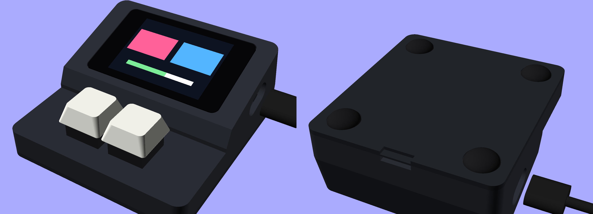

# OPad case V1.1

Revision of `../V1` for the V1 PCBs: the controller carrier on its 8.5 mm sockets and the MX or Hall Effect input module. The PCBs are unchanged (`hardware/pcb/V1`). The case coordinates are the same as V1, so the key centres (28.475 / 47.525, 16.5) and the module holes (15.5 / 60.5, 16.5) have not moved.

**Fully screwless:** the bottom plate snaps on, the input module is clamped between the key deck and the bottom plate, and the screen is held by its glass on a taped ledge.



## What changed from V1

| | V1 | V1.1 |
|---|---|---|
| Height, key deck | 17.0 mm | **12.0 mm** |
| Height, rear | 37.0 mm | **33.3 mm** |
| Footprint | 76 × 86 mm | **76 × 82.5 mm** |
| Walls | 2.2 mm | **2.4 mm** (3 perimeters at 0.4 mm, the usual design-guide minimum) |
| Screen tilt | 20.3° | **16°** |
| Glass | 0.1 mm below the frame, 0.09 mm clearance per side | **flush with the frame** (on 0.15 mm tape), 0.3 mm clearance per side, 1.25 mm ledge |
| Carrier stack | did not fit (floor, pillars) | fits; 0.6 mm above the floor at its lowest point |
| Screen supports | 4 pillars, not on the Waveshare holes | 4 posts under the carrier's M2 holes, 0.5 mm below it |
| Input module | no mount | **screwless:** pins under the key deck locate it, posts on the bottom plate clamp it |
| Snap fit | short relief-cut tabs that flex across the print layers (≈ 6 % strain, likely to crack) | **rigid rim with 0.55 mm beads at mid-span**; the long top-case walls take the flex (≈ 1–2 % strain) |
| Feet | 4 × Ø 10 recesses | **4 × Ø 12.7 recesses** for soft silicone bumpers |

The screen sits in its own raised pod behind a step. The 8.5 mm sockets make the Waveshare + carrier stack about 20 mm deep, and that depth, not the key deck, sets the rear height. The remaining height comes from three things:
- the tilt: every degree less lowers the rear by about 0.35 mm;
- the socket pin tails, which set how close the stack can get to the floor;
- the 2.5 mm male-header plastic on the Waveshare.

## Keeping it in place

There is no added weight: a 3D-printed pad of this size stays put on a desk mat with the right feet.
- **Feet:** four soft **silicone** bumpers, 12.7 mm (1/2"), about 3.5 mm tall, in the corner recesses. Silicone grips a cloth mat far better than hard rubber or felt.
- **Infill:** the case prints at about 50 g if solid (40.7 cm³ of PLA), so 100 % infill (or PETG) adds 15–20 g over a typical 20 %.
- **Tapping helps:** each press pushes the pad down onto its feet, which increases the grip at the moment it matters. Slipping comes from the small sideways part of a tap.
- **If it still moves:** stick a 1 mm self-adhesive silicone anti-slip sheet over the whole base instead of the four feet.

## Parts

| Qty | Part | For |
|---|---|---|
| 4 | Silicone bumper, Ø 12.7 mm, ~3.5 mm tall, self-adhesive | corner recesses |
| — | Thin double-sided tape, 0.1–0.15 mm | glass edge on the ledge (`TAPE_T`; thicker tape leaves the glass proud) |
| optional 4 + 4 | M2 × 8.5 mm male-female spacers + M2 × 4 mm screws | Waveshare standoffs to carrier, if you want the stack rigid; the posts leave room for the screw heads |

No screws or inserts are needed for the case itself.

## Assembly

1. Fit the switches into the input module's hot-swap sockets through the key deck from the top, with the module held underneath, components facing down and J1 toward the screen. The two pins under the deck go through the module's M2 holes.
2. Plug the Waveshare onto the carrier. Plug the JST cable into J_MOD at the carrier's left (non-USB) end.
3. Lower the screen stack into the pod from the top, USB-C to the right, and tape the glass edge to the ledge.
4. Route the cable forward along the left wall and into the module's J1. A 100 mm same-direction cable leaves about 40 mm of slack.
5. Snap the bottom plate on: its posts clamp the module against the key deck. It is removed by prying at the rear notch.
6. Stick the four feet into the recesses.

## Printing

- **Top case:** upright, open side down, with supports under the key deck and the screen pod.
- **Bottom plate:** base down, no supports.
- **Material:** PLA works. PETG is tougher at the snap beads and slightly heavier.

## Files

| File | |
|---|---|
| `osupad_params.scad` | every dimension, and the derived heights |
| `osupad_enclosure.scad` | the parts: `PART = "top_case"`, `"bottom_plate"` or `"assembly"` |
| `osupad_case_top.stl`, `osupad_case_bottom.stl` | print files |
| `osupad_render.png`, `osupad_preview.png` | finished render (front and underside), and the bare case |
| `tools/check_fit.py` | intersects everything that goes inside (below) with each case part; exits 1 on any overlap |
| `tools/reference_models.scad` | the Waveshare stack, carrier, input modules, USB plug and cable as envelopes |
| `tools/waveshare_back.scad` | the Waveshare's back-side components as boxes, measured from Waveshare's STEP model (the model itself is not included) |

After changing a parameter:

```
python3 tools/check_fit.py                 # needs OpenSCAD; about a minute
python3 tools/check_fit.py -D TILT=14      # any parameter can be overridden
openscad -o osupad_case_top.stl    -D 'PART="top_case"'     osupad_enclosure.scad
openscad -o osupad_case_bottom.stl -D 'PART="bottom_plate"' osupad_enclosure.scad
```

Checked on 2026-09-24:
- 39 intersections are clear: 19 reference parts × 2 case parts, plus the two case parts against each other.
- Deliberate collisions are detected, which confirms the check reports real overlaps:
  - `-D FLOOR_CLR=-1.5` drops the screen stack 2 mm: caught on the carrier, tails, J_MOD and screw heads.
  - Lowering the module 0.5 mm is caught on the PCB against the clamp posts, and on J1 against the floor.
- Both STLs are watertight.
- The module's clamp posts and deck bosses touch the PCB exactly: 0 mm nominal. FDM tolerance decides whether it is snug or has a few tenths of play.

**Not yet checked on a real print:**
- the glass fit;
- the snap beads;
- the module clamp.

Print the bottom plate first: it's quick, and it shows whether the beads click and the posts reach the module.
